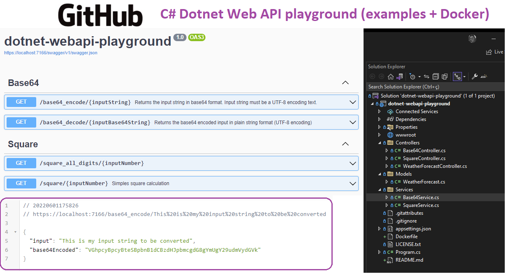
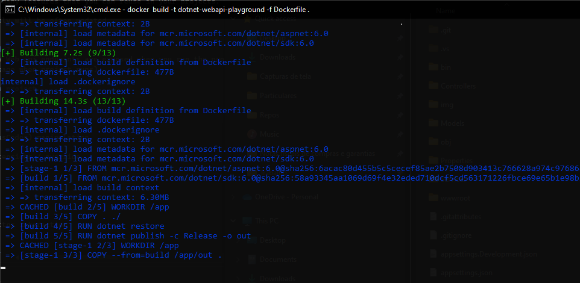
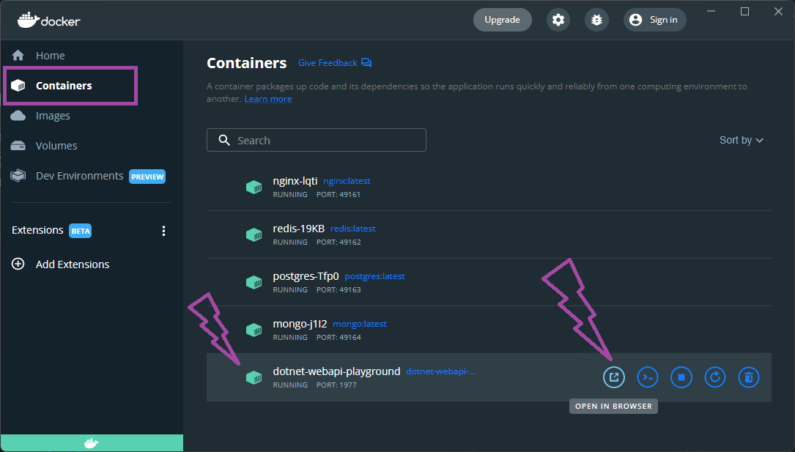

# C# dotnet web API playground (many examples + Docker deploy)


 
# Context
Many times we need to publish RESTful microservices, well documented and deployed in Docker containers (Kubernetes, Google Cloud Run, Serverless platforms etc.).

This playground project shows many features that you can reuse in your projects.

It is a live project and will likely be updated frequently.


# What does this application do?
- The app do many things. Many Web api endpoints are exposed when you run the project.
- See documentation (default page when project runs)

# Stack and main topics in the project
- .NET 6.0 webapi application
    - C# 
    - REST WebAPI
    - Objects and Json parser
    - Return Codes (HTTP StatusCodes) manipulation
    - Memory Caching
    - Native C# data types extensions / override


- Docker
    - docker build
    - docker run
    - docker container http/https interaction 


# About the Author and license
- **Erick** is a Senior Backend Developer and Architect. 
- You can reach **Erick** by email <seixaserick77@gmail.com> or Linkedin <https://www.linkedin.com/in/seixaserick/>
- Other Github Repositories: <https://github.com/seixaserick/> 
- MIT License (please check [LICENSE.txt](LICENSE.txt) for more details)


# How to run this project 

## Clone the repository

If you already installed Git for Windows, run commands below:
```
git clone https://github.com/seixaserick/dotnet-webapi-playground
cd dotnet-webapi-playground
```


# How to run this project in Docker containers
> If you already installed Docker Desktop, just follow these steps below


## Creating a docker image
To create a Docker image, run command line below in the command prompt of project directory:
```
docker build -t dotnet-webapi-playground -f Dockerfile .
```


## Running the app in a docker container





To run the image in Docker container and interact with it, run command line below: 
```
docker run -it -p 1977:80 --name=dotnet-webapi-playground --restart=always dotnet-webapi-playground
```




Open: [http://localhost:1977/square/8](http://localhost:1977/square/8)  (without https)


To stop the container, run command line below: 
```
docker stop dotnet-webapi-playground
```

To remove the container (even if it is running), run command line below: 
```
docker rm --force dotnet-webapi-playground
```


# How to build and run without Docker (Windows)

> After clone the repository you can open the project with Visual Studio. Build or just debug it pressing ```F5```.

## To compile and run it in Windows (Visual Studio required)
> Open the solution file ```dotnet-webapi-playground.sln``` with your Visual Studio, then press ```F5``` to run the project!


# Takeaways

- Swagger is a great documentation generator
- C# WebApis are very light to run inside Docker Containers with lesse than 256MB RAM
- Json Parse is made by dotnet in an easy and lightweight way
- Docker is a nice tool to run projects quickly without concern about dependencies and configurations.
- C# is very similar to other ECMA-based languages (Java, Javascript etc.)
- Good Markdown README.md files can help other developers to understand, clone, run and test projects.

# Homework challenge

1. Create a new Object Model in the Models folder and create a new api endpoint (HTTP GET method) to do some calculations and return this new object.
2. Create a new C# data type extension and use it to manipulate your native datatypes. Example: Create a ```string extension``` to do ```.ToBase64Encode()```, then you can try ```inputString.ToBase64Encode();``` instead Function approach.
3. Create a new POST API endpoint to receive some object and do something with it, returning a result.
4. Try to implement Redis distributed cache in some endpoint.
